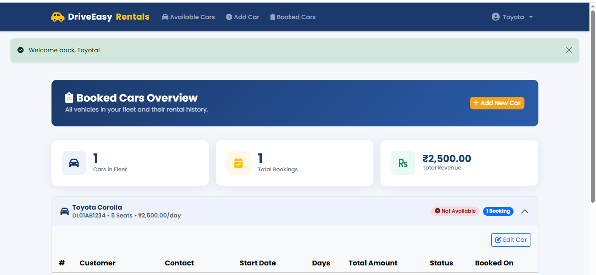
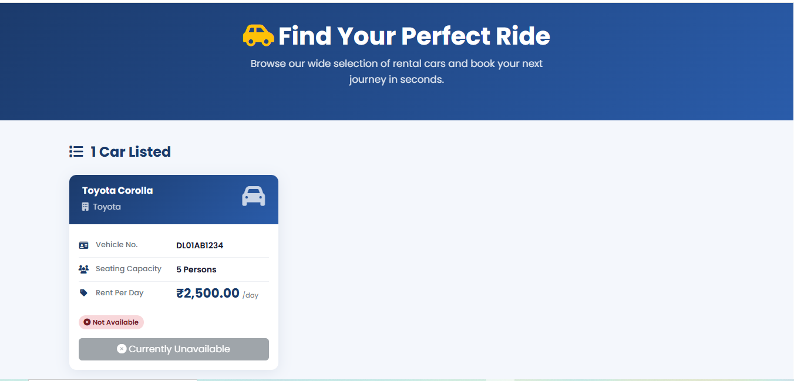
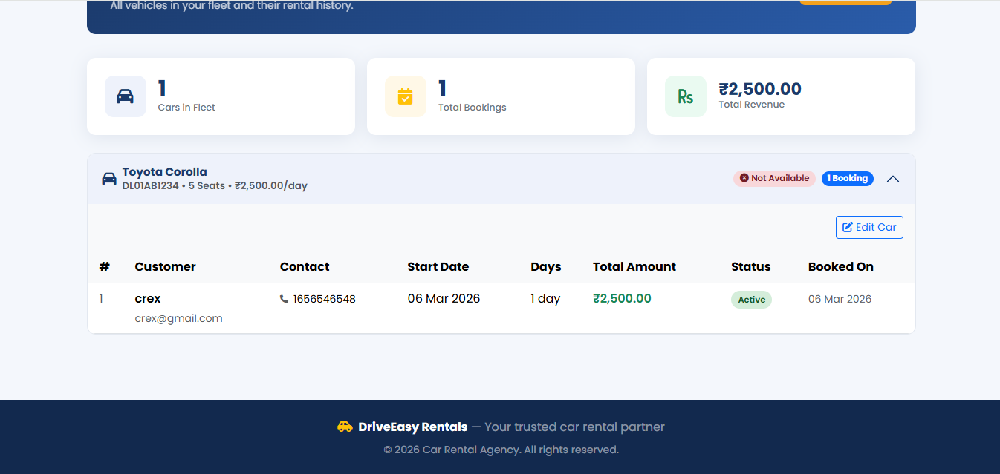

# 🚗 DriveEasy Rentals — Car Rental Agency

A full-stack **PHP + MySQL** web application that connects car rental agencies with customers. Agencies can list and manage their vehicles; customers can browse and book available cars in real time.

🌐 **Live Demo:** [http://carrentalagency.kesug.com](http://carrentalagency.kesug.com)

---

## �� Screenshots

### 🏠 Home — Available Cars


### 🚘 Car Listing with Booking Details


### 📋 Agency — Booked Cars Overview


---

## ✨ Features

### 👤 Customer
- Register & log in as a customer
- Browse all available cars (public — no login required)
- Book a car by selecting start date & number of days
- Live cost estimate updates as you change rental days
- View personal booking history with total spend summary

### 🏢 Car Rental Agency
- Register & log in as an agency
- Add new cars to the fleet (model, number, seats, rent/day)
- Edit car details and toggle availability (mark as available again after rental)
- View all bookings for each car — customer name, contact, dates, amount, status
- Dashboard stats: total cars, total bookings, total revenue

### 🔒 Security & Access Control
- Agencies **cannot** book cars
- Guests are redirected to login when trying to book
- All protected pages enforce server-side auth guards (302 redirect)
- Passwords hashed with `bcrypt`
- All user input sanitized with `htmlspecialchars` + prepared statements (no SQL injection)
- DB transaction + row-level lock on booking (prevents double-booking)

---

## 🛠️ Tech Stack

| Layer | Technology |
|---|---|
| Frontend | HTML5, CSS3, JavaScript (ES6) |
| UI Framework | Bootstrap 5.3 |
| Icons | Font Awesome 6 |
| Fonts | Google Fonts — Poppins |
| Backend | PHP 8.3 (Core PHP) |
| Database | MySQL / MariaDB |
| Hosting | InfinityFree (Free tier) |

---

## 🗄️ Database Schema

```
car_rental_db
├── customers    (id, full_name, email, password, phone, created_at)
├── agencies     (id, agency_name, email, password, phone, address, created_at)
├── cars         (id, agency_id, vehicle_model, vehicle_number, seating_capacity, rent_per_day, is_available)
└── bookings     (id, car_id, customer_id, start_date, num_days, total_amount, status, booked_at)
```

---

## 📁 Project Structure

```
CarRentalAgency/
├── index.php                  # Available Cars (public)
├── login.php                  # Tabbed login (Customer / Agency)
├── register_customer.php      # Customer registration
├── register_agency.php        # Agency registration
├── add_car.php                # Add car (agency only)
├── edit_car.php               # Edit car + availability toggle (agency only)
├── booked_cars.php            # Agency fleet & booking history
├── my_bookings.php            # Customer booking history
├── config/
│   └── db.php                 # DB connection config
├── includes/
│   ├── functions.php          # Auth helpers, flash messages, sanitization
│   ├── header.php             # Shared navbar + flash alert
│   └── footer.php             # Shared footer
├── assets/
│   ├── css/style.css          # Custom stylesheet
│   └── js/main.js             # Live cost calculator, date picker, password toggle
├── process/                   # Form handlers (POST only)
│   ├── login.php
│   ├── logout.php
│   ├── register_customer.php
│   ├── register_agency.php
│   ├── add_car.php
│   ├── edit_car.php
│   └── book_car.php
└── database.sql               # MySQL schema (import via phpMyAdmin)
```

---

## 🚀 Local Setup

### Prerequisites
- PHP 8.0+
- MySQL / MariaDB

### Steps

**1. Clone the repository**
```bash
git clone https://github.com/Anujyadav911/CarRentalAgency.git
cd CarRentalAgency
```

**2. Create the database**
```bash
mysql -u root -p
CREATE DATABASE car_rental_db;
exit
mysql -u root -p car_rental_db < database.sql
```

**3. Configure DB connection**
```bash
cp config/db.example.php config/db.php
# Edit config/db.php with your credentials
```

**4. Start the PHP dev server**
```bash
php -S localhost:8000
```

**5. Open in browser**
```
http://localhost:8000
```

---

## 📝 Usage

1. **Register as an Agency** → Add cars to your fleet
2. **Register as a Customer** → Browse & book available cars
3. **Agency Dashboard** → View all bookings and revenue per car
4. **Edit Car** → Toggle availability to re-list a returned car

---

## 👨‍💻 Author

**Anuj Yadav**  
GitHub: [@Anujyadav911](https://github.com/Anujyadav911)

---

## 📄 License

This project is open source and available under the [MIT License](LICENSE).
